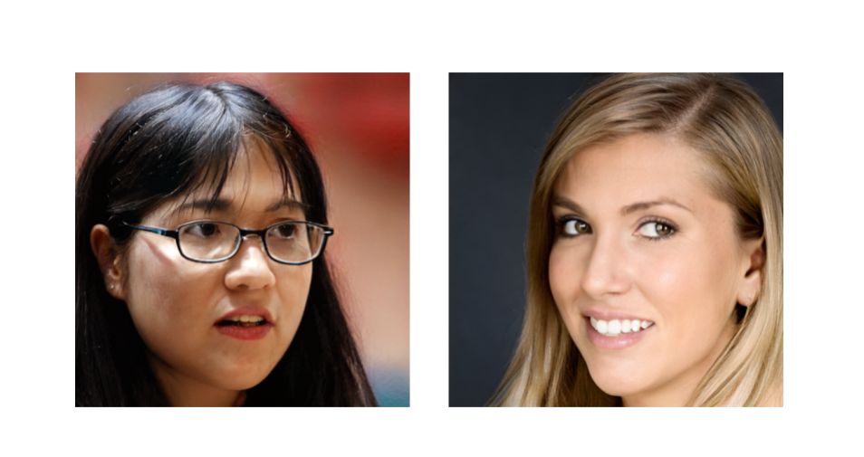

# facehash - verify data integrity with hyper-realistic human faces



## What is this?

Cryptographic hash functions are widely used for verifying data integrity, but long hexadecimal (or worse, binary) representations are hard for humans to remember. In contrast, humans have evolved to parse other human faces instantly and to [store thousands of them in memory.](https://www.science.org/content/article/average-person-can-recognize-5000-faces#:~:text=To%20qualify%20as%20%22knowing%22%20a,of%20the%20Royal%20Society%20B%20.)

This makes faces the ideal representation for cryptographic hashes, for the sake of quickly checking if some data has changed, even after a long time has passed.

## Usage

```bash
install_dir=/path/to/install/facehash
python3 -m venv $install_dir
$install_dir/bin/pip install git+https://github.com/alebeck/facehash --find-links https://download.pytorch.org/whl/torch_stable.html
alias facehash="$install_dir/bin/python ..."
```

## How does it work?

We extend the input data's SHA512 hash to 512 bytes by appending eight nonce values to the input and concatenating the outputs. Each byte is expected to be uniformly distributed in its value range, due to the chaotic nature of the hash. We use a Box-Muller transform to deterministically map the uniformly distributed bytes to a 512-dimensional Gaussian latent vector, that is expected by the Generator function of StyleGAN2.